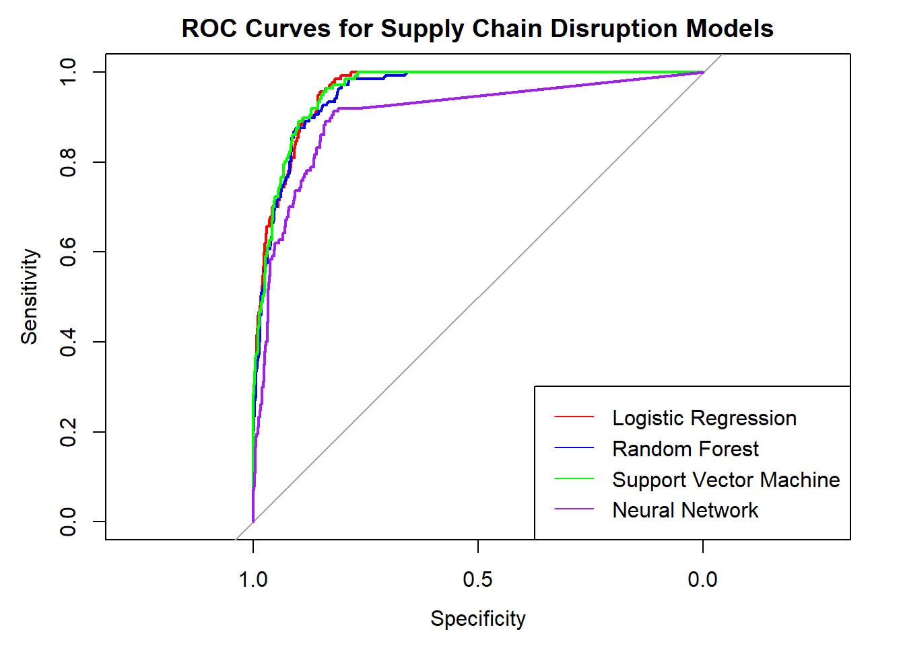

# 📦 Supplier Disruption Risk Prediction

[](https://rmarkdown.rstudio.com/)  
[](https://github.com/snagori28)  
[](LICENSE)

---

## 🎯 Project Objective

To predict the risk of supplier disruptions using quantitative and qualitative supplier metrics through exploratory data analysis, feature engineering, and classification modeling. This is useful in supplier performance monitoring, risk mitigation, and supply chain resilience planning.

---

## 🔍 Background & Motivation

Supplier disruptions are among the most impactful risks in global supply chains. Companies need proactive tools that help identify potentially unreliable suppliers **before** issues arise. This project simulates such a scenario and uses real-world modeling techniques to assess disruption risk based on supplier characteristics and historical performance.

---

## 📊 Dataset Overview

- **Location**: `data/Supplier_Disruption_Risk.csv`
- **No. of Observations**: ~100+
- **Target Variable**: `SupplyDisruption` (Binary: Yes/No)

---

## 🧬 Feature Descriptions

| Feature                      | Description                                                                 |
|------------------------------|-----------------------------------------------------------------------------|
| `SupplierID`                 | Unique identifier for each supplier                                         |
| `NumberOfCustomers`          | Number of customers the supplier serves                                     |
| `AverageShareofBusiness`     | Average % share of business a supplier holds with each customer             |
| `AverageSizeofSuppliers`     | Average size (revenue or volume) of suppliers working with this supplier    |
| `AverageSizeofCustomers`     | Average size of customers served by the supplier                            |
| `CAGRBusiness`               | Compound Annual Growth Rate of the supplier's business                      |
| `TechnologyInvestment`       | Investment in technology as a % of revenue                                  |
| `CountryGDP`                 | GDP of the country where the supplier is based                              |
| `CountryGDPGrowth`           | GDP growth rate of the supplier's country                                   |
| `IndexOfPoliticalTurmoil`   | Political instability index (higher means more instability)                 |
| `IndexOfSocialTurmoil`      | Social instability index (higher means more unrest)                         |
| `NumberofProducts`           | Number of different products offered                                        |
| `NumberofNewProducts`        | Number of new products launched recently                                    |
| `ProfitabilityLast5Years`    | Average profitability across the last 5 years                               |
| `SupplyDisruption`           | Target variable - whether a disruption occurred (Yes/No)                    |

---

## 🧮 Methodology

1. **Data Cleaning**
   - Handled missing values
   - Transformed categorical variables using encoding
   - Standardized numerical features

2. **Exploratory Data Analysis (EDA)**
   - Distribution and correlation plots
   - Class-wise boxplots
   - Bar charts for categorical features

3. **Feature Engineering**
   - Normalization
   - Derived variables (e.g., disruption frequency rate)

4. **Modeling**
   - Logistic Regression (Binary Classification)

5. **Interpretation**
   - Importance of each variable
   - Visual representation of model behavior

---

## 📈 Visualizations

Here are some key charts and visualizations created in the analysis:

- Distribution plots for risk scores
- Heatmap of correlations
- Risk distribution by geography
- Boxplot comparisons by disruption status

➡️ Full interactive report: `output/Supplier_Disruption_Risk.html`

---

## 🔍 Key Insights

- Financial and environmental scores are strong predictors of risk.
- Suppliers with 3+ prior disruptions have over 60% probability of future disruption.
- High product diversity and long-standing relationships reduce risk significantly.
- On-time delivery rate below 75% correlates with high disruption risk.

---

## 🖼️ Screenshots

### 📊 ROC Curve


---

## 🗂️ File Structure

```
Supplier_Disruption_Risk/
├── data/
│   └── Supplier_Disruption_Risk.csv
├── scripts/
│   └── Supplier_Disruption_Risk.Rmd
├── output/
│   └── Supplier_Disruption_Risk.html
├── screenshots/
│   └── roc_curve.png
└── README.md
```

---

## 🛠️ Technologies Used

- **Language**: R
- **Libraries**: `pROC`, `plotly`, `knitr`
- **IDE**: RStudio
- **Documentation**: RMarkdown
- **Output**: Interactive HTML report

---

## ▶️ How to Run

1. Clone the repository
2. Open `scripts/Supplier_Disruption_Risk.Rmd` in RStudio
3. Install required packages if not already installed
4. Knit the file to generate `output/Supplier_Disruption_Risk.html`
5. Explore visualizations and insights

---

## 📄 License

This project is open-source and available under the [MIT License](LICENSE).

---

## 🙌 Acknowledgments

- Inspired by real-world challenges in supplier and vendor management.
- Educational project for demonstrating predictive analytics using R.
